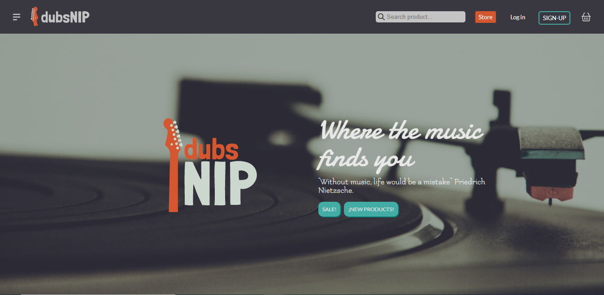

# DubsNip

Website created as a project for Henry bootcamp. E-commerce for a music store, you can:
- **Guest**: use it as guest, see the products and have a cart.
- **User**: create a user, have a cart, buy it through Mercado Pago. You have your order history, you can check the state of your orders, the price, make reviews of the product you bought, etc
- **Admin**: if you are an admin, you have the admin page (add, delete, edit products, categories, users, edit orders state, etc).

## Deploy

The page is deplyed,  in Heroku and Vercel, so you can view it in your browser:
  * [DubSnip](https://dubsnip-dubsnip.vercel.app/)
This version is for web.

## Stack

  * Node
  * PostgreSQL
  * Sequelize
  * Express
  * Passport
  * React
  * Redux
  * Styled-components

## Authors

  * [Franco Ascarate](https://github.com/francoasc)
  * [Lis Jardim](https://github.com/lis-cyber)
  * [Juan Castro Arancibia](https://github.com/jucaran)
  * [Sixto Acuña](https://github.com/sacunap)
  * [Joaquín Franco](https://github.com/joafran)
  * [María Laura Puccinelli](https://github.com/laupucci)

## Start

- **Fork**: the repo into your GitHub account

- **Install**: all the dependencies on both, the back (api folder) and the front end (client folder).
> npm install

- **Version**: your version of Node must be equal or greater than V.14.
> node -v

- **Env**: in api and client you will have to create a file named ".env" with the following form, filling each one of the variables:
> DB_USER=userPostgreSQL
> DB_PASSWORD=passwordPostgreSQL
> DB_HOST=localhostPostgreSQL
> PORT=1337
> JWT_SECRET
> GOOGLE_CLIENT_ID
> GOOGLE_CLIENT_SECRET
> MAILGUN_API_KEY
> MAILGUN_DOMAIN
> MERCADOPAGO_ACCESS_TOKEN
> API_URL=http://localhost:1337
> CLIENT_URL=http://localhost:3000

- **Start**: initialize the App with the following command in both terminals.
npm start

